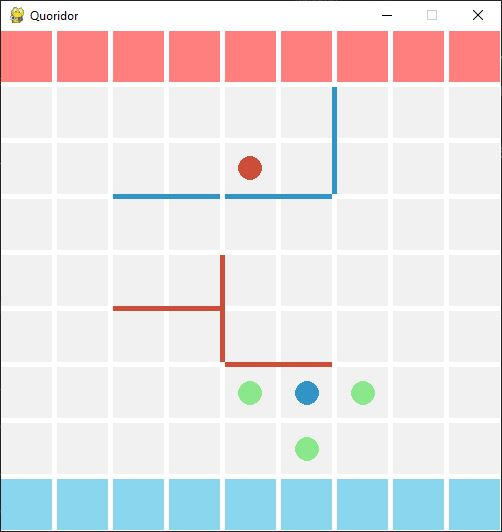

# QuoridorGame
Implementation of the **Quoridor** board game. It uses [pygame](https://www.pygame.org/news).

## Screenshot

## How to play

This is a two player implementation of the Quoridor Board game. Each player gets 10 fences. For game rules please see [here](https://www.ultraboardgames.com/quoridor/game-rules.php)

 To make a move:
 * Press "p" to move your pawn. It will display the possible moves and you can click on the square you want your pawn to move. 

 * Press "h" to place a horizontal fence. If you still have remaining fences, it will display every possible position. If you click between 2 squares vertically aligned it will place a horizontal fence, starting from the left of the square. 

 * Press "v" to place a vertical fence. If you still have remaining fences, it will display every possible position. If you click between 2 squares horizontally aligned it will place a vertical fence starting from the top of the square. 

 To restart the game, press "Backspace" at any point. 

## Pathfinding algorithm

An A* pathfinding algorithm is used to check if a player is blocked or not, thanks to the [python-pathfinding](https://github.com/brean/python-pathfinding) project. 

## License
[MIT](https://choosealicense.com/licenses/mit/)